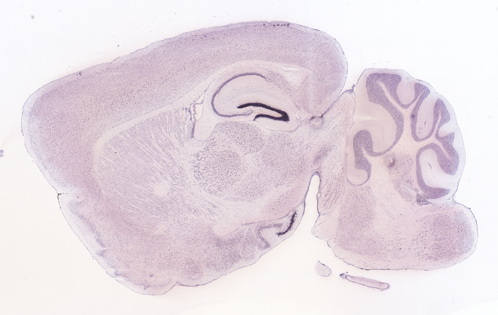
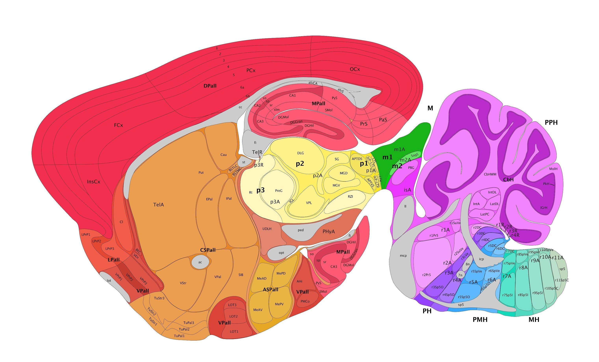
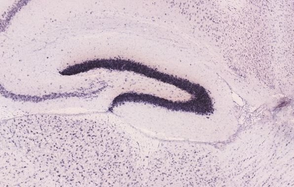
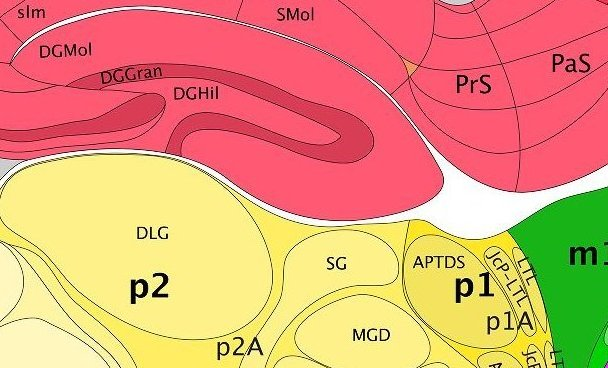
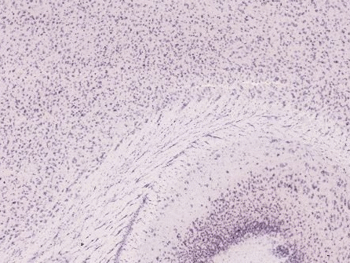

Table of Contents
=================

-   [allenBrain](#allenbrain)
    -   [Example usage](#example-usage)
        -   [Image acquisition](#image-acquisition)
        -   [Region expression data](#region-expression-data)
        -   [Incomplete stuff](#incomplete-stuff)

allenBrain
==========

This R package acquires pictures from Allen Brain Atlas. Cropping and centering images requires magick that is listed in `Suggests` so it won't be automatically installed. Get it by:

``` r
install.packages("magick")
```

Install allenBrain to R

``` r
devtools::github_install('oganm/allenBrain')
```

Example usage
-------------

### Image acquisition

You can use `downloadImage` and `downloadAtlas` functions to get images. Output of these functions are `magick-image` objects

``` r
library(dplyr)


# get a list of structure names and ids
IDs = getStructureIDs()
IDs %>% head
```

    ##    id                          name  acronyms parent
    ## 1 997                          root      root   <NA>
    ## 2   8 Basic cell groups and regions      grey    997
    ## 3 567                      Cerebrum        CH      8
    ## 4 688               Cerebral cortex       CTX    567
    ## 5 695                Cortical plate     CTXpl    688
    ## 6 315                     Isocortex Isocortex    695

``` r
# get the id of the desired region
granuleID = IDs['Dentate gyrus, granule cell layer' == IDs$name,]$id

# get the dataset for the desired gene (the first saggital experiment that did not fail)
datasetID = getGeneDatasets(gene = 'Prox1',
                            planeOfSection = 'sagittal',
                            probeOrientation = 'antisense')[1]


# get the slide that has the desired brain region and coordinates of the center of the region
imageID = structureToImage(datasetID = datasetID, regionIDs = granuleID)

# get the closest atlas image. 
atlasID = imageToAtlas(imageID$section.image.id,imageID$x,imageID$y,planeOfSection ='sagittal')

# decide how much to you wish to downsample
downsample = 2

# download the slide
downloadImage(imageID = imageID$section.image.id, 
             view = 'projection',
             outputFile = 'README_files/image.jpg',
             downsample = downsample)
```



``` r
# download the atlas
downloadAtlas(imageID = atlasID$section.image.id, 
             outputFile = 'README_files/atlas.jpg',
             downsample = downsample)
```



Images can be centered by providing center coordinates of a brain region. Input is either a file path or a `magick-image` object

``` r
# crop the slide so that the desired brain region is in the center
centerImage(image = 'README_files/image.jpg', 
            x = imageID$x,
            y= imageID$y,
            xProportions = c(.1,.1),
            yProportions =c(.1,.1),
            outputFile = 'README_files/cropped.jpg',
            downsample = downsample)
```



``` r
centerImage(image = 'README_files/atlas.jpg', 
            x = atlasID['x'],
            y= atlasID['y'],
            xProportions = c(.1,.1),
            yProportions =c(.1,.1),
            outputFile = 'README_files/croppedAtlas.jpg',
            downsample = downsample)
```



### Image syncronization

You can get closets points of other slides from the same dataset to get other slides depicting the region

``` r
# gel all images for Prox1 experiment
allImages = listImages(datasetID)  %>% arrange(as.numeric(`section.number`))

# get coordinates that are closest to the center of the brain region
closeSections = imageToImage2D(imageID$section.image.id,imageID$x,imageID$y,allImages$id)

# download and crop them all
croppedImage = closeSections %>% apply(1,function(x){
    # download and crop the images
    image = downloadImage(imageID = x['section.image.id'], 
             view = 'projection',
             # outputFile = file.path('README_files/allProx1',x['section.image.id']),
             downsample = downsample)
    
    centerImage(image = image, 
            x = x['x'],
            y= x['y'],
            xProportions = c(.1,.1),
            yProportions =c(.1,.1),
            # outputFile = file.path('README_files/allProx1',x['section.image.id']),
            downsample = downsample)
}) %>% do.call(c,.)

# some magick
animation = magick::image_animate(croppedImage, fps = 1)
magick::image_write(animation, "README_files/Prox1.gif")
```



### Region expression data

Region expression can be acquired by datasetID. Data displayed in ABA web portals is expression.energy.

``` r
head(getStructureExpressions(datasetID))
```

    ##   expression.density expression.energy        id section.data.set.id
    ## 1         0.00877632          1.256040 417549802            69289763
    ## 2         0.00877632          1.256040 417549811            69289763
    ## 3         0.00977504          1.435310 417549818            69289763
    ## 4         0.00829527          1.240160 417549825            69289763
    ## 5         0.00490790          0.625739 417549832            69289763
    ## 6         0.00435703          0.550791 417549837            69289763
    ##   structure.id sum.expressing.pixel.intensity sum.expressing.pixels
    ## 1        15564                      990364000             6919940.0
    ## 2        15565                      990364000             6919940.0
    ## 3        15566                      788831000             5372270.0
    ## 4        15567                      612042000             4093880.0
    ## 5        15568                        9924780               77843.7
    ## 6        15569                        2830360               22389.6
    ##   sum.pixel.intensity sum.pixels voxel.energy.cv voxel.energy.mean
    ## 1         38839100000  788478000         2.29688          1.247900
    ## 2         38839100000  788478000         2.29688          1.247900
    ## 3         27367800000  549591000         2.34411          1.429890
    ## 4         24459100000  493519000         2.66998          1.231220
    ## 5           682957000   15860900         1.23383          0.633086
    ## 6           235064000    5138730         1.48268          0.558472
    ##   structure.acronym structure.color.hex.triplet structure.graph.order
    ## 1             mouse                      C86A39                     0
    ## 2                NP                      C86A39                     1
    ## 3                 F                      C86A39                     2
    ## 4                SP                      A84D10                     3
    ## 5               RSP                      A84D10                     4
    ## 6             POTel                      A84D10                     5
    ##   structure.hemisphere.id structure.id.1                   structure.name
    ## 1                       3          15564                     Mus musculus
    ## 2                       3          15565                     neural plate
    ## 3                       3          15566                        forebrain
    ## 4                       3          15567         secondary prosencephalon
    ## 5                       3          15568 rostral secondary prosencephalon
    ## 6                       3          15569           preoptic telencephalon
    ##   structure.ontology.id              structure.safe.name
    ## 1                    12                     Mus musculus
    ## 2                    12                     neural plate
    ## 3                    12                        forebrain
    ## 4                    12         secondary prosencephalon
    ## 5                    12 rostral secondary prosencephalon
    ## 6                    12           preoptic telencephalon
    ##   structure.st.level           structure.structure.id.path
    ## 1                 -1                               /15564/
    ## 2                  0                         /15564/15565/
    ## 3                  1                   /15564/15565/15566/
    ## 4                  2             /15564/15565/15566/15567/
    ## 5                  3       /15564/15565/15566/15567/15568/
    ## 6                  4 /15564/15565/15566/15567/15568/15569/
    ##   structure.structure.name.facet structure.weight
    ## 1                     3843147059             8390
    ## 2                     3041346888             8390
    ## 3                     2526114016             8390
    ## 4                      333870831             8390
    ## 5                     2675393843             8390
    ## 6                     2617066679             8390

If you want to get all genes, use `listGenes` to get all available genes for the species. Then do `getGeneDatasets`.

``` r
genes = listGenes()

geneDatasets = genes$acronym[1:10] %>% lapply(getGeneDatasets)
```

You may want to limit your search space as getting the data for all genes is a slow process.

### Incomplete stuff

Grid data of a dataset can be downloaded by `gridData` function

``` r
gridData(datasetID = datasetID,
         outputFile ='README_files/Prox1_data.zip',
         include = c('energy','density','intensity'))
unzip(zipfile = 'README_files/Prox1_data.zip',exdir = "README_files")
```
